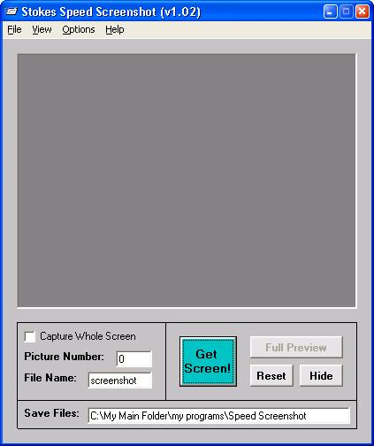



## Speed Screenshot

### Description

This program is designed so that anybody can take alot of screenshots really fast! Taking screenshots is done either by clicking the "Get Screen" button on the main, or for even faster and better results, hide it in the tray and just keep double clicking the tray icon! Also has a hot key "Ctrl+G"! It will automatically save pics for you in the directory where u installed it. Enjoy! :)
 
### More Info
 

             |
---                |---
**Submitted On**   |2003-05-25 02:12:06
**By**             |[Ryan33](https://github.com/Planet-Source-Code/PSCIndex/blob/master/ByAuthor/ryan33.md)
**Level**          |Intermediate
**User Rating**    |5.0 (35 globes from 7 users)
**Compatibility**  |VB 6\.0
**Category**       |[Complete Applications](https://github.com/Planet-Source-Code/PSCIndex/blob/master/ByCategory/complete-applications__1-27.md)
**World**          |[Visual Basic](https://github.com/Planet-Source-Code/PSCIndex/blob/master/ByWorld/visual-basic.md)
**Archive File**   |[Speed\_Scre1592205252003\.zip](https://github.com/Planet-Source-Code/ryan33-speed-screenshot__1-45705/archive/master.zip)

